# sge_theBear_grupB

## CRUD DE PUNTO DE VENTA

### GET
Fem un get de tots els Punts de Venta
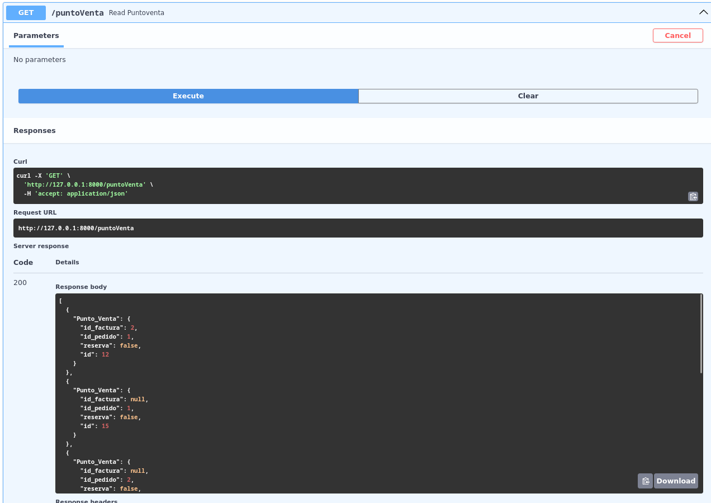

Ara, fem un get pero de un Punt de venda, que aquest s'escollirà per la id
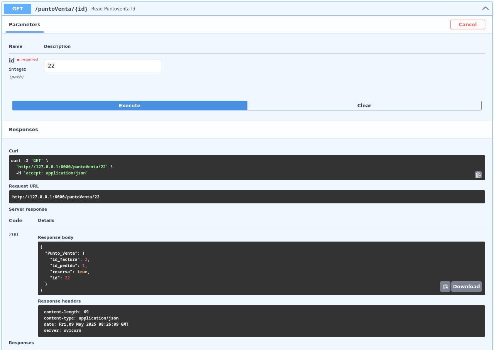

### POST
Creem un Punt de venda, es important dir que l'únic atribut obligatori de posar és reserva
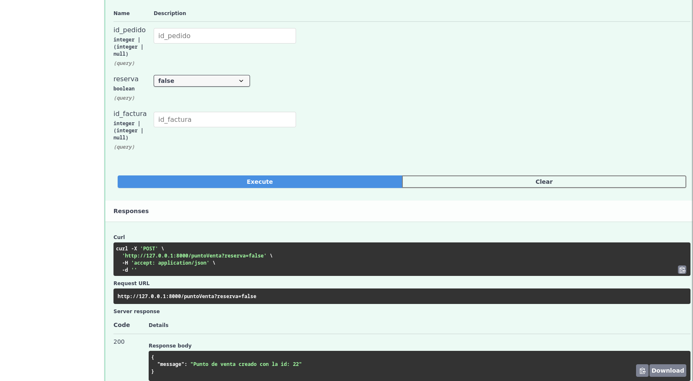

### PUT
L'update es pot fer de tots els atributs alhora o fer-ho per individual

Aquest és un update de tots els atributs alhora
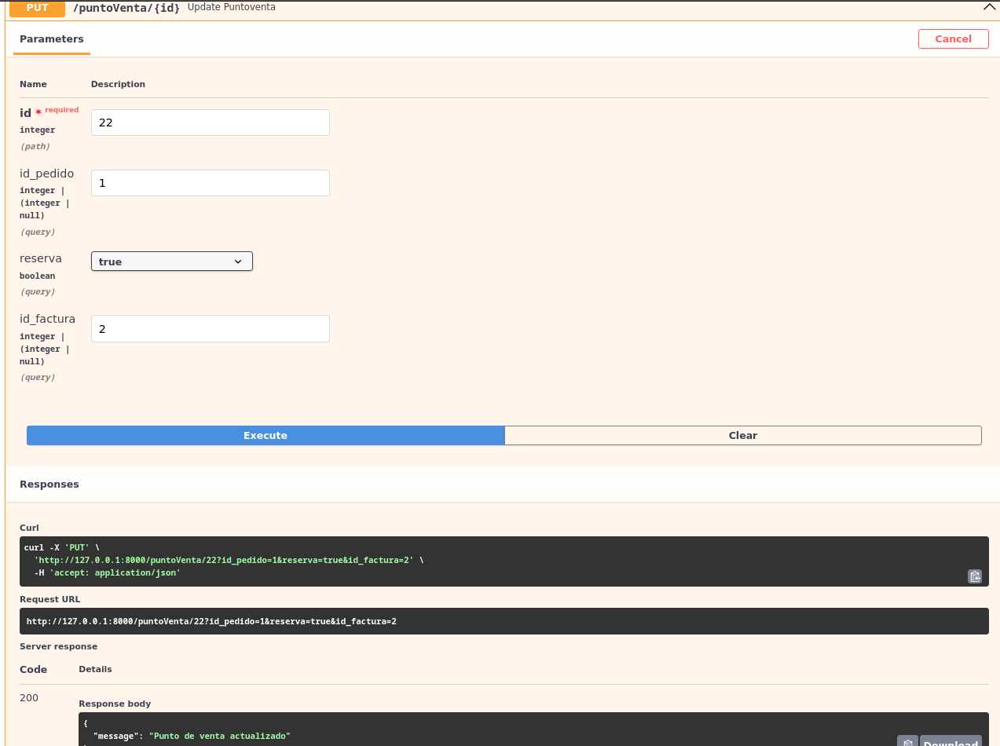

Ara, actualitzarem id_pedido

Actualitzarem reserva, que aquest es un bool(True o False)
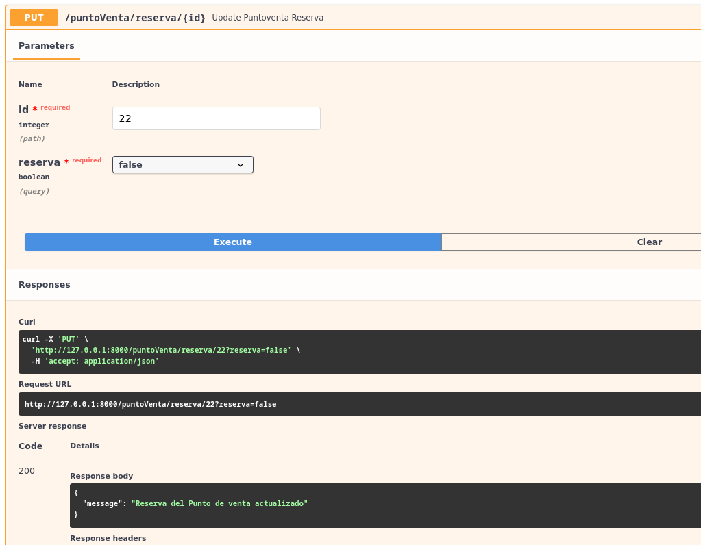

L'ultim update serà per actualitzar la id_factura
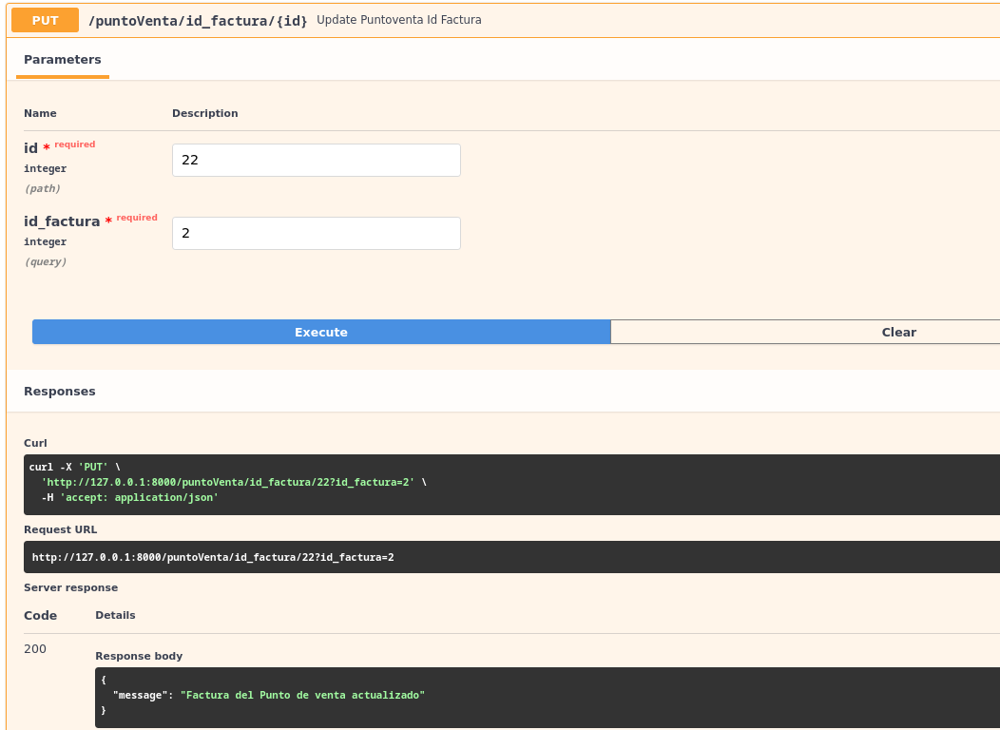

### DELETE
El delete, busca una id d'un Punt de venda i l'elimina
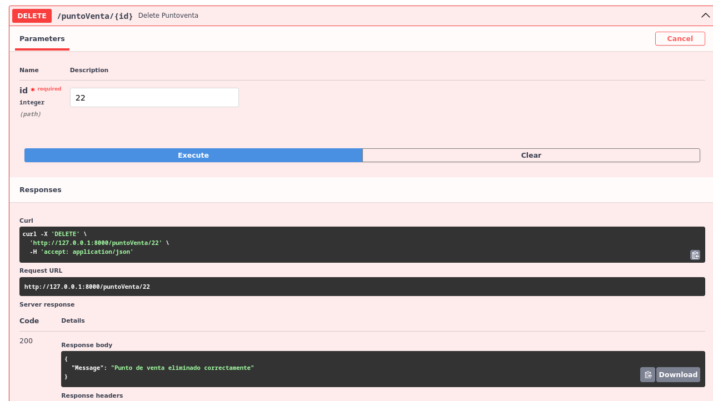

## CRUD DE FACTURA

### GET
Primer, un get de totes les factures
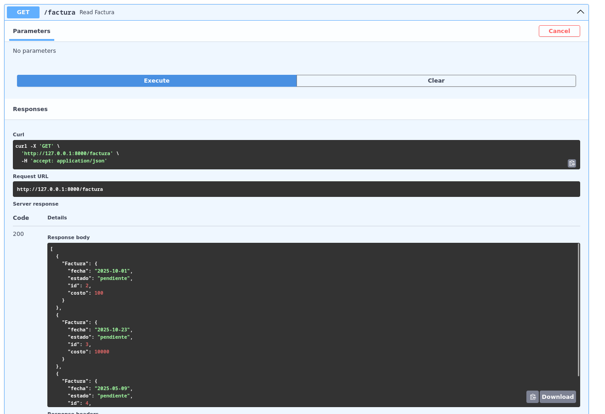

Després, buscarem per id
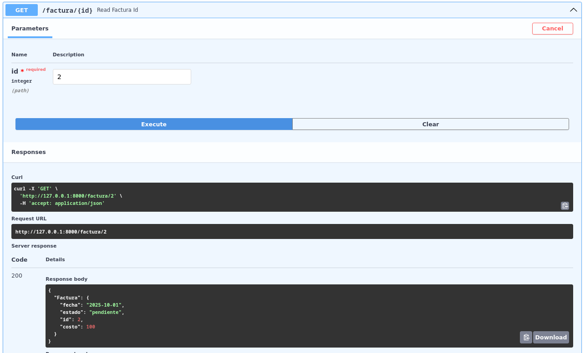

### POST
Amb els post es pot afegir una factura, tots els atributs son Obligatoris
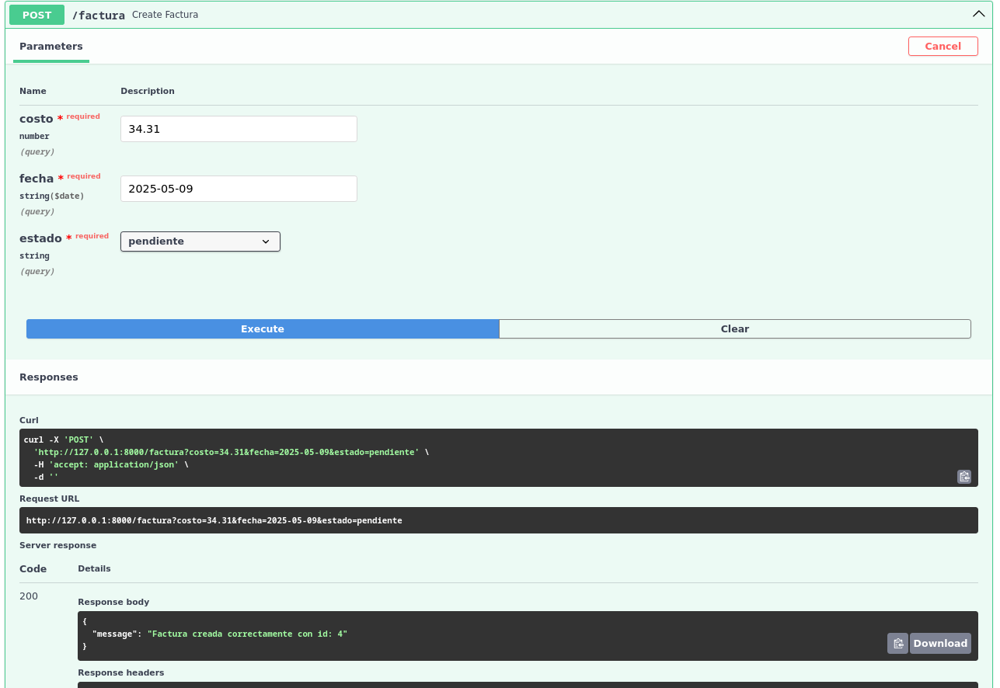

### PUT
L'update es pot fer de tots els atributs alhora o fer-ho per individual

Primer, el update de tots els atributs
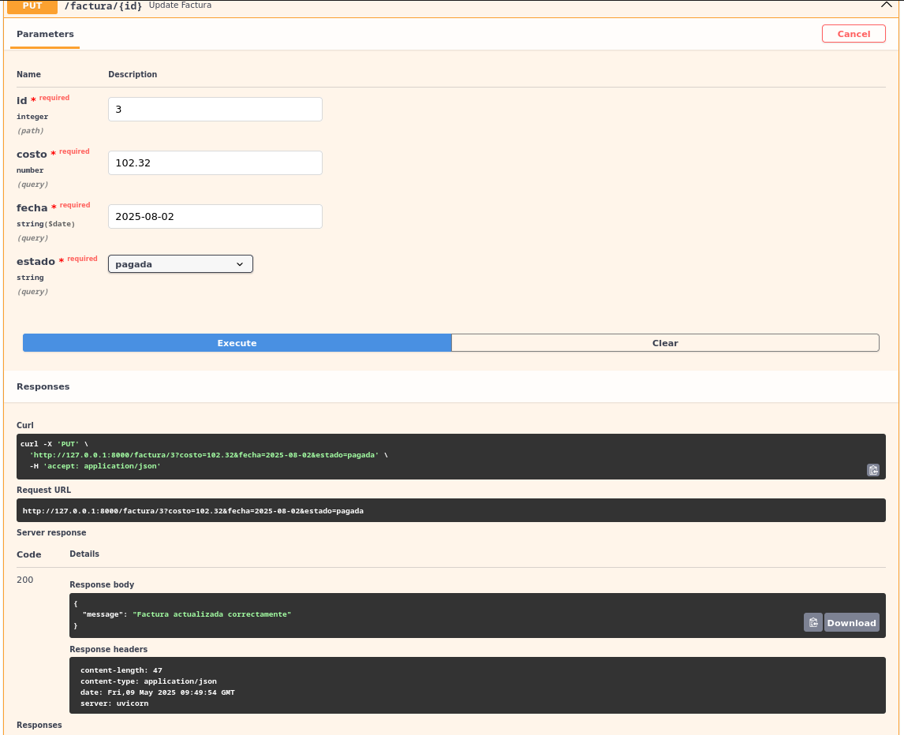

Com l'altre, es pot canviar dada per dada, aquesta vegada el cost
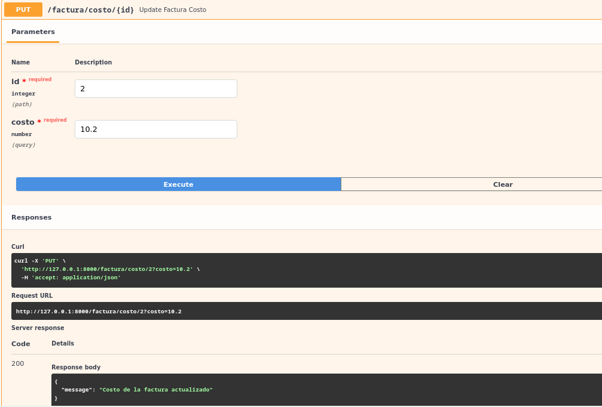

Ara ho podem fer de la data(Tipus de dada: date)
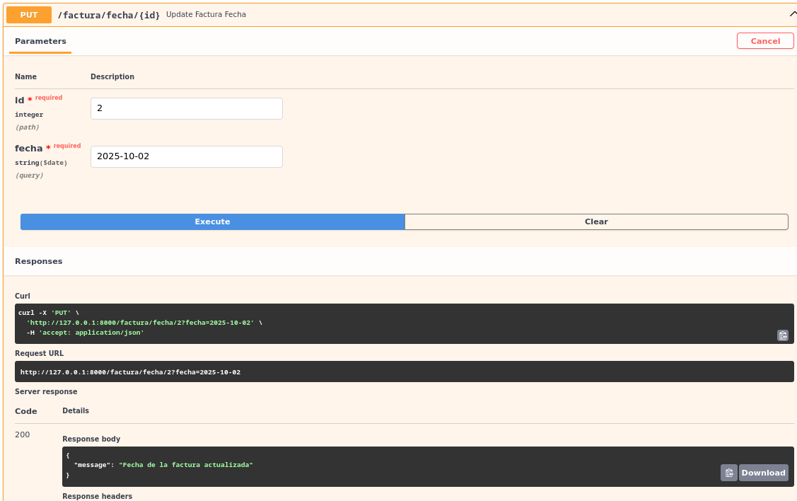

I per últim del Estat de la factura que es un enum
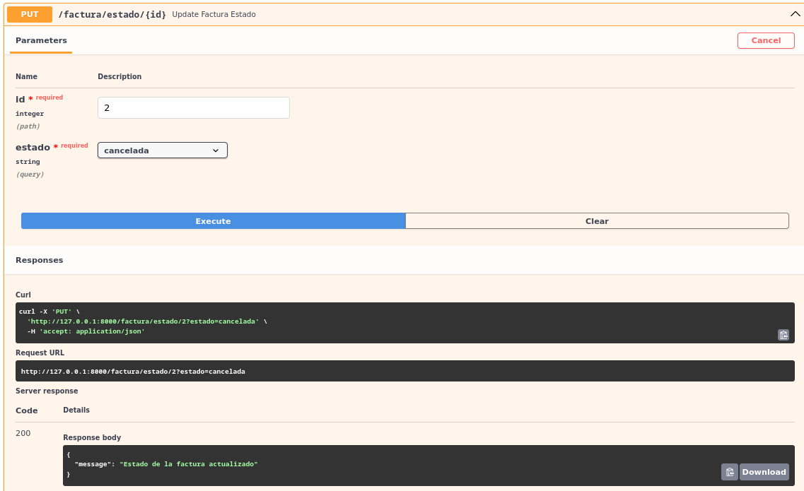

### DELETE

I com Punt de venda, ho podem eliminar per id
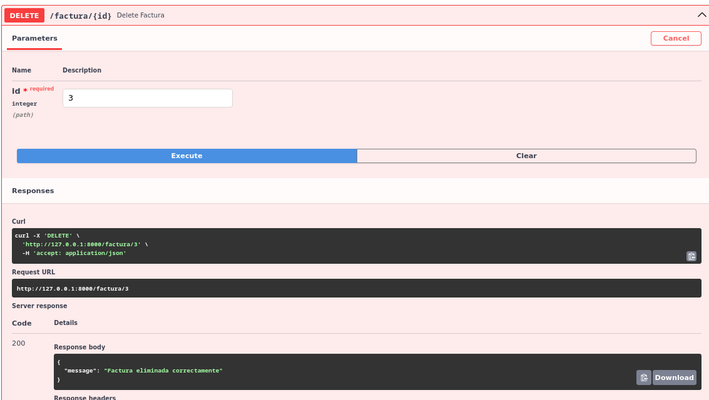

## CRUD DE PRODUCTOS

### GET

Fem un get de tots el productes.

Ara el mateix pero de un producte en especific usant la seva ID

### POST

Crearem un producte, on tots els camps son obligatoris

### PUT

Amb l'update podrem actualitzar tots els camps alhora o individualment

Amb aquest update actualitzarem tots els camps

Amb aquest actualitzarem el camp de preu individualment

I amb aquest el stock

### DELETE

Amb el delete podrem eliminar un producte usant la seva ID

## CRUD DE PEDIDOS

# GET

Amb el get podrem veure totes le comandes creades, el seu estat, el client asociat a la comanda i el producte.

Amb el seguent Get tan sols veurem la comanda asociada al ID introduit

# POST

Ara crearem una comanda introduit el ID del client i el del producte

# PUT

Amb el update podrem actualizar el estat de la comanda

# DELETE

El delete eliminara la comanda amb el ID introduit
