# sge_theBear_grupB

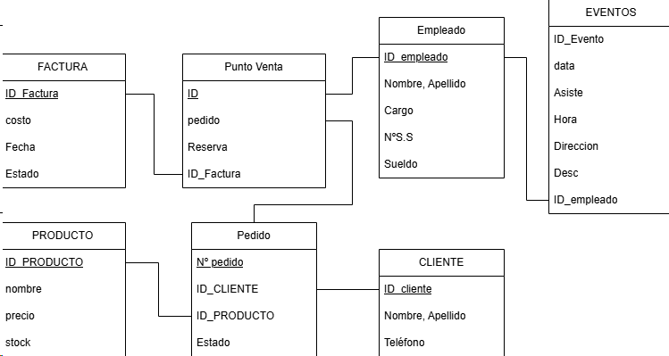

## CRUD DE PRODUCTOS

### GET

Fem un get de tots el productes.
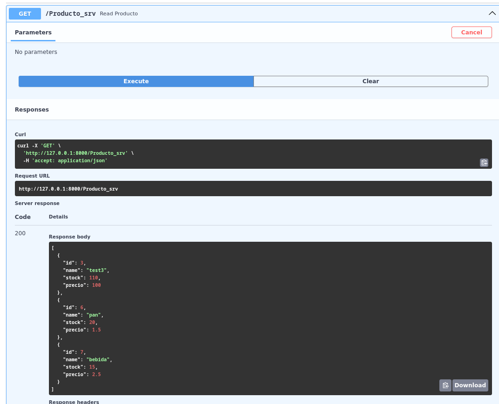

Ara el mateix pero de un producte en especific usant la seva ID
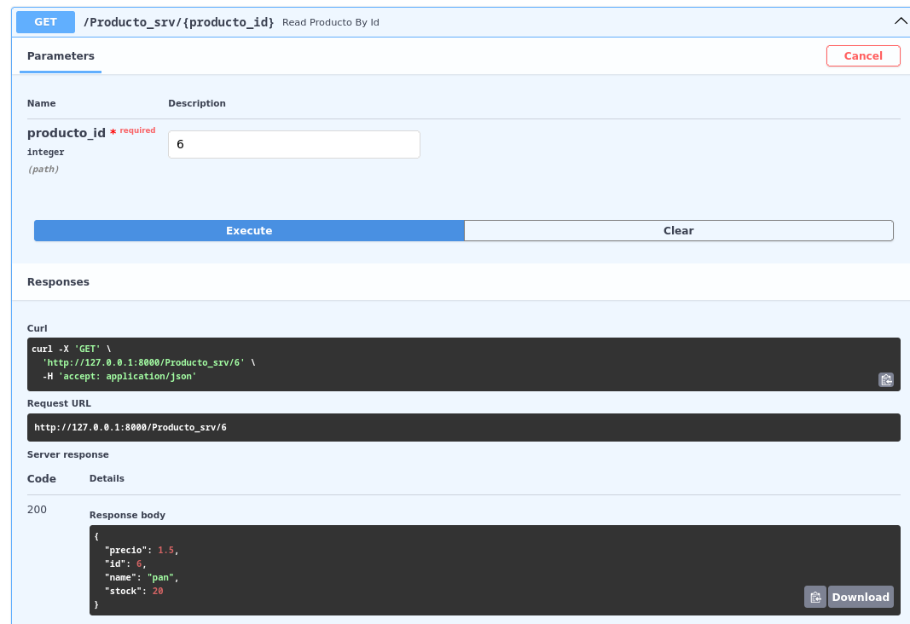

### POST

Crearem un producte, on tots els camps son obligatoris
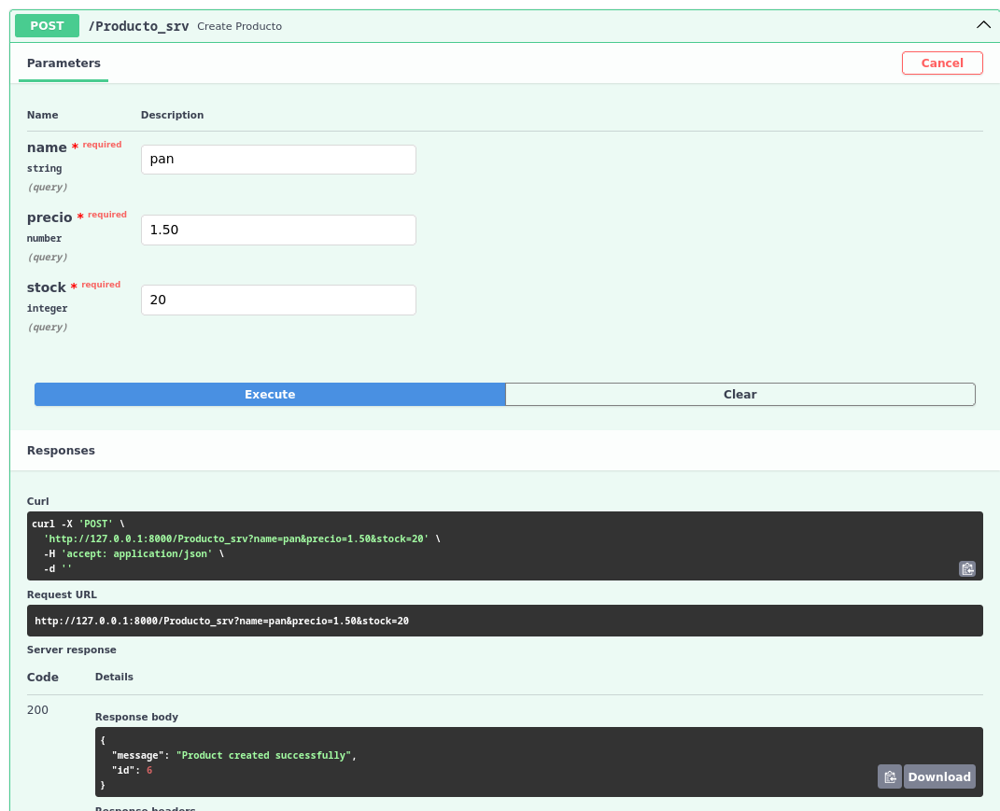

### PUT

Amb l'update podrem actualitzar tots els camps alhora o individualment

Amb aquest update actualitzarem tots els camps
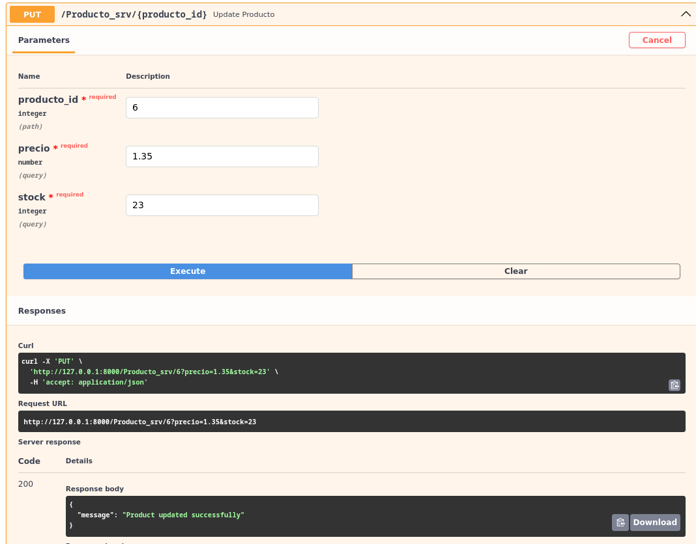

Amb aquest actualitzarem el camp de preu individualment
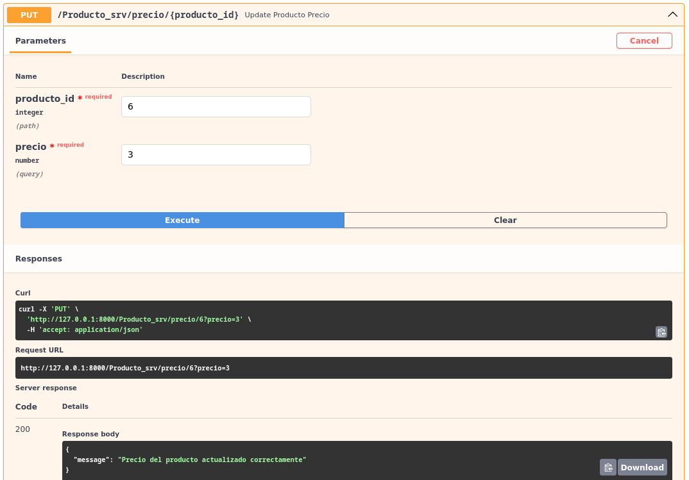

I amb aquest el stock
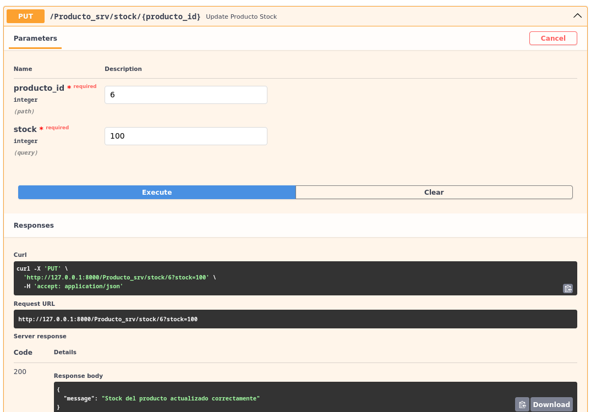

### DELETE

Amb el delete podrem eliminar un producte usant la seva ID
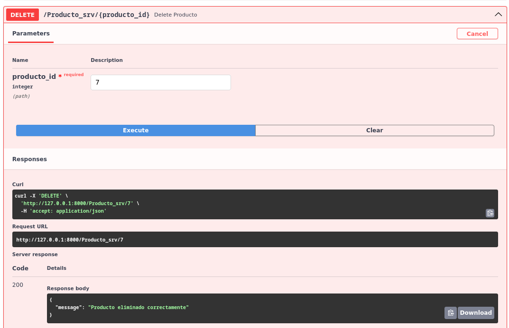

## CRUD DE PEDIDOS

# GET

Amb el get podrem veure totes le comandes creades, el seu estat, el client asociat a la comanda i el producte.
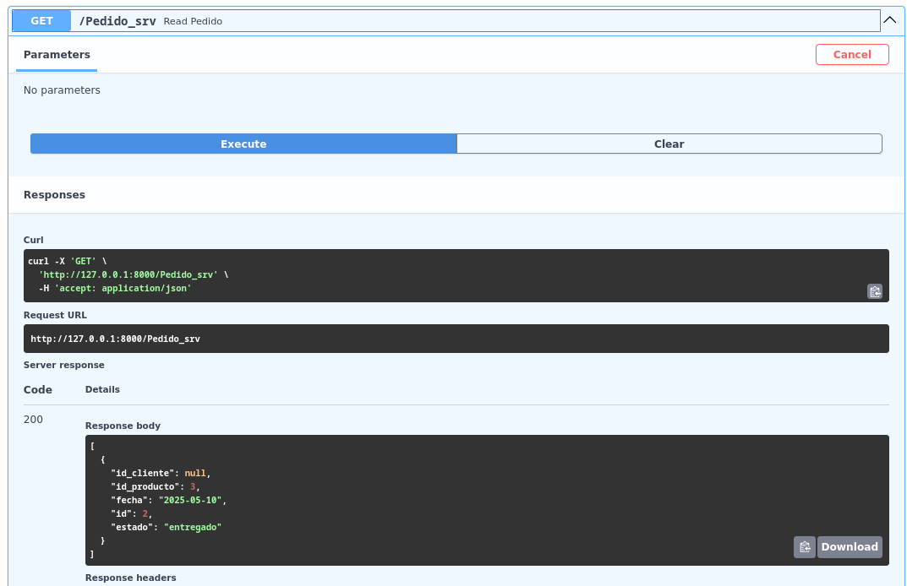

Amb el seguent Get tan sols veurem la comanda asociada al ID introduit
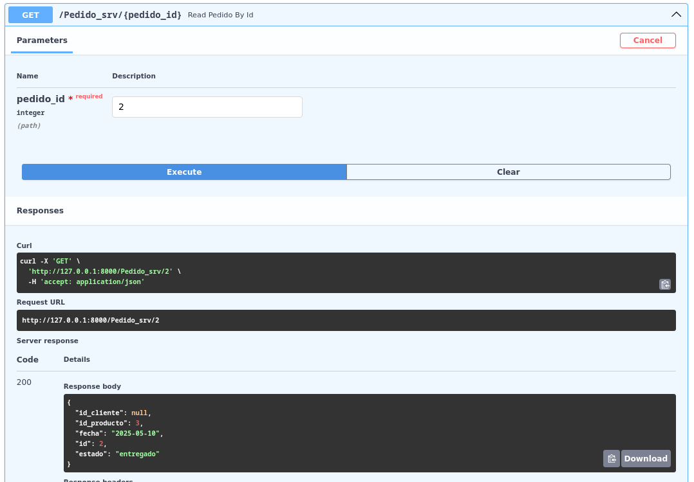

# POST

Ara crearem una comanda introduit el ID del client i el del producte
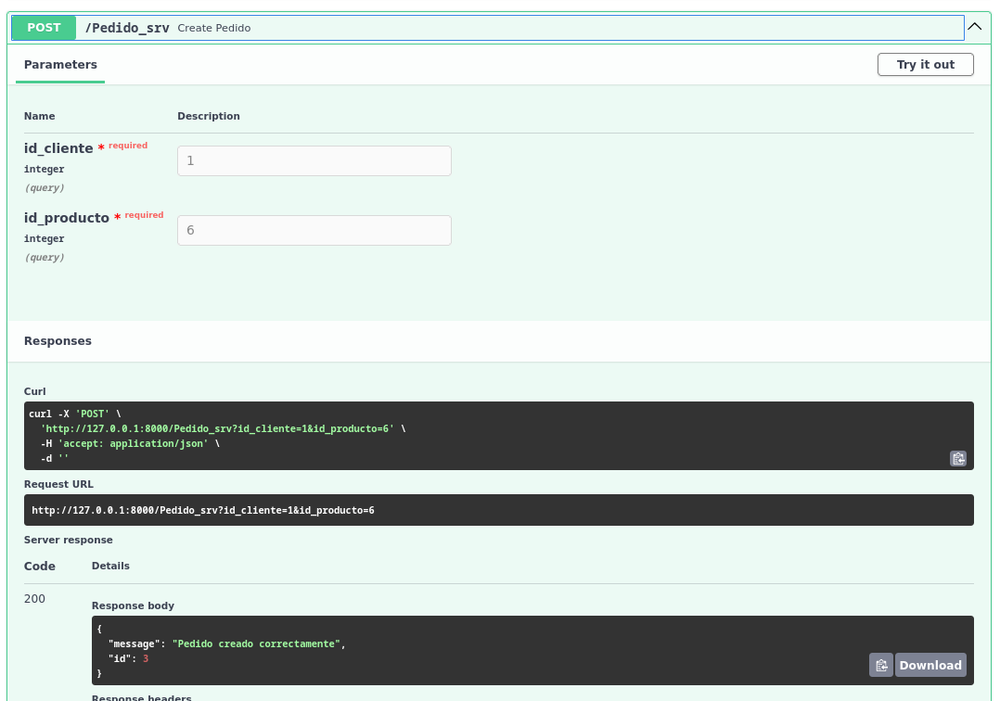

# PUT

Amb el update podrem actualizar el estat de la comanda
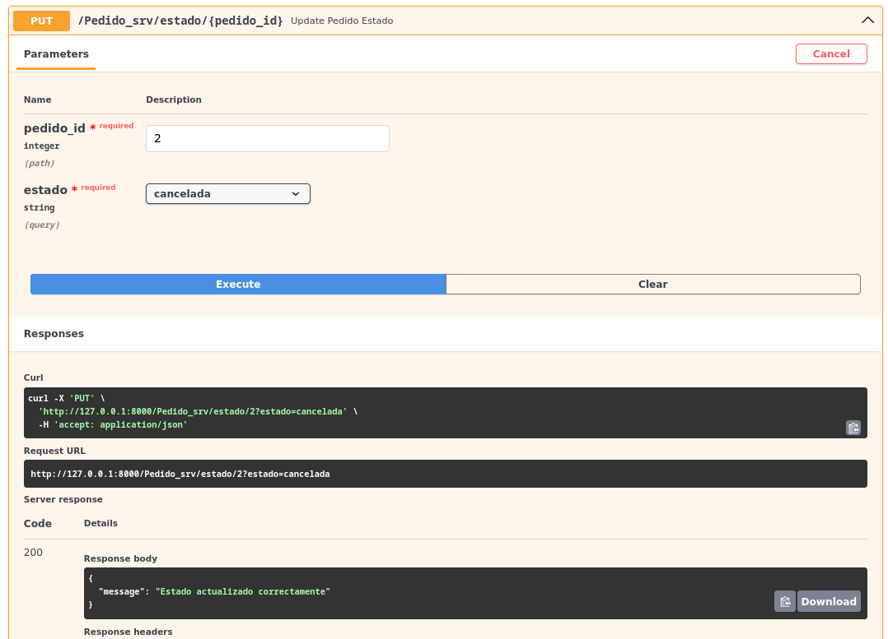

# DELETE

El delete eliminara la comanda amb el ID introduit
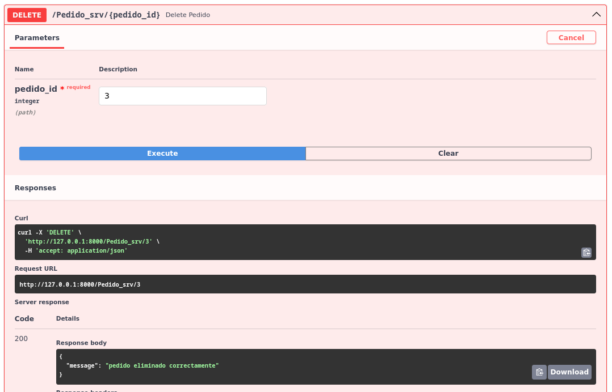

