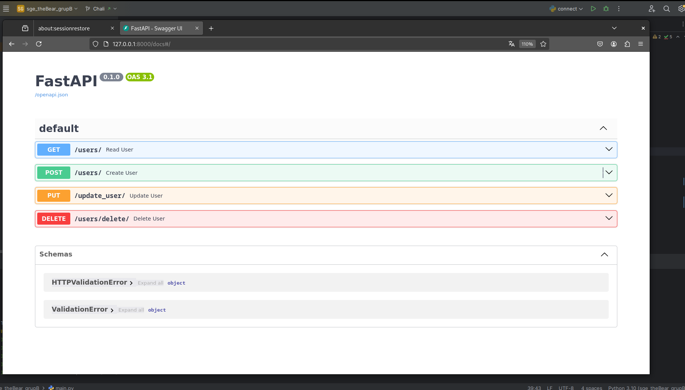

Així es mostra quan entrem amb les 4 opcions

Mostra les 2 persones que tenim afegides a la nostra base de dades

Actualitzem 1 nom de les persones que tenim guardades

S'ha canviat de nom Juan a Pablo

Ara eliminem el mateix

I veiem que de les 2 persones només apareix 1